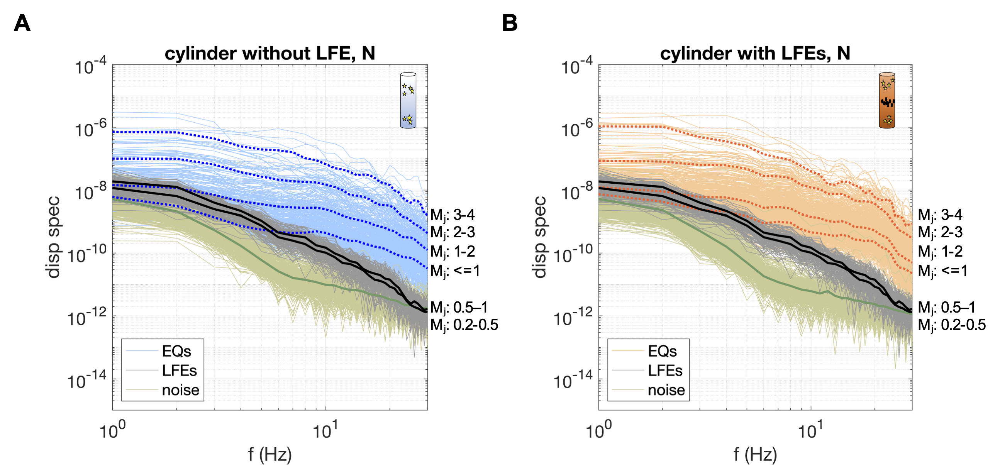

**Earthquake sciences changed significantly in the past decades with, in particular, the discovery of slow-deformation processes in addition to ordinary earthquakes.  Those slow earthquakes play a major role in the earthquake cycle, but their physical mechanisms remain poorly understood. New methods and multi-disciplinary focused studies allow us now to expand our frontier in slow earthquake science complexity and diversity. We use geophysical methods such as InSAR analysis, geodetic solutions, and seismic catalogs as our main research tools to explore this field.**

## Subdaily dynamics of slow slip
**_Reproducing geodetic aseismic fault slip from low-frequency earthquake time history at high sampling rates_**

Slow slip events were first discovered in the early 2000s as a long-lasting release of energy visible on continuous surface motion as a reverse of the direction of motion of the GNSS station. While slow slip events are still mostly observed using GNSS surface motion, geodetic measurement only capture their long spatial- and temporal-wavelength behavior. Low-frequency earthquakes, small repeating earthquakes on the plate boundary, are often spatiotemporally correlated with slow slip, giving us the opportunity to explore slow slip dynamics at shorter time scales. Many studies highlighted the existence of a short time scale component in the complex dynamics of slow slip events using both seismic and geodetic datasets. Here, we are focusing our research on two main questions: (1) To what extent can we use low-frequency earthquake activity history to learn about slow slip short time scale dynamics? (2) What is the relationship between the aseismic slip observed by geodetic observables and the seismic slip associated with low-frequency earthquakes?

Our project focuses on slow slip events happening in the Guerrero region of the Mexican Subduction zone. This area is a "seismic gap", where large megathrust earthquakes have not occurred during the last century. Because of its specific flat geometry, the rheological conditions in this region allows the occurrence of large Mw7.5 slow slip events every 4 years, and smaller Mw6.4 every more frequently. The deployement of a large seismic network crossing all Mexico between 2005 and 2008 give us the opportunity to study the seismic activity associated to the large Mw7.5 2006 slow slip event recorded by GNSS stations.

We explore those previous questions in this context by creating a simple fault slip model using both geodetic and seismic observables. This model is driven by the time history of low-frequency earthquakes at both daily and subdaily time scales to reproduce the geodetic record of the slow slip cycle including the large 2006 slow slip event of Guerrero. This simple approach reveals the limits of low-frequency earthquakes as a proxy to study slow slip. The slow slip cycle can be tracked by low-frequency earthquakes only when looking at individual phases of the cycle, whereas trying to modelise a full slow slip cycle needs a more complex approach. A non-linear relationship is needed between the aseismic and seismic fault slip to represent all the different phases of this slow slip cycle. We also observe that long-term loading rates on the order of plate convergence are necessary for our models to fit well the geodetic fault slip, implying 100% coupling on the plate interface at short time scales.

## Interaction with earthquakes
**_Sous-sous-titre: blabla_**

Blabla Louise

## Role in seismic cycle
**_Sous-sous-titre: blabla_**

Blabla Louise & caro

## What makes low-frequency earthquakes low frequency?
**The roles of attenuation and source**

Low-frequency earthquakes, atypical seismic events distinct from regular earthquakes, occur downdip of the seismogenic megathrust where an aseismic rheology dominates the subduction plate boundary. The spectra of low-frequency earthquakes are consistent with the classical earthquake model, yet their rupture duration and stress drop are orders of magnitude different from ordinary earthquakes. 

image
  caption: (Spatiotemporal behavior and spectra of low-frequency and regular earthquakes in the Nankai Trough. (modified from Wang et al., 2023, under review)

The Nankai Trough, where low frequency earthquakes were first observed, is monitored by a long-term borehole monitoring network that has recorded low-frequency earthquakes in the same epicentral area as both crustal and intraslab earthquakes. We focus on two depth columns directly beneath two seismic stations where the subduction interface is sandwiched between earthquakes above and below, with one depth column hosting low-frequency earthquakes and the other not. With this unique seismic geometry, we investigate the endmember possibilities of attenuation experienced by low-frequency earthquakes to isolate their source process. Through this natural controlled experiment, we place key constraints on the character of the low-frequency earthquake source to address the outstanding question: **_what makes low-frequency earthquakes low frequency?_**

We observe that the source regions of the low frequency earthquakes are marked by high pore fluid pressure indicated by high _Qp/Qs_ and _Vp/Vs_ ratios. This suggests that local variations in the rheology of this transitional zone, just downdip of where major earthquakes occur and where slow fault slip dominates the tectonic slip budget, are responsible for earthquakes that rupture an order of magnitude more slowly than is typical. An atypical rupture mechanism associated with this rheology, likely governed by processes linked to saturated fault conditions at the plate boundary, is necessary to explain the low-frequency earthquake source. We conclude their low-frequency nature primarily results from an atypical seismic rupture process rather than near-source attenuation. Attenuation is not what makes low-frequency earthquakes low frequency.

